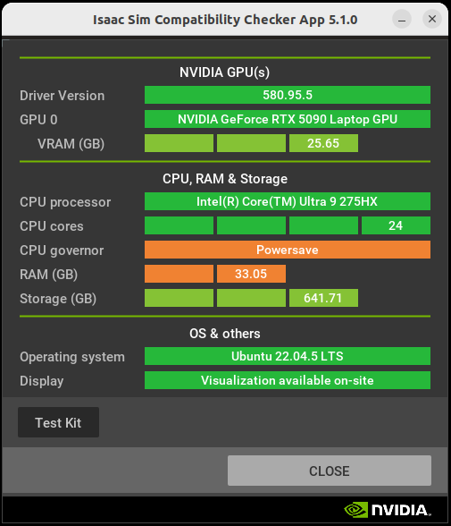
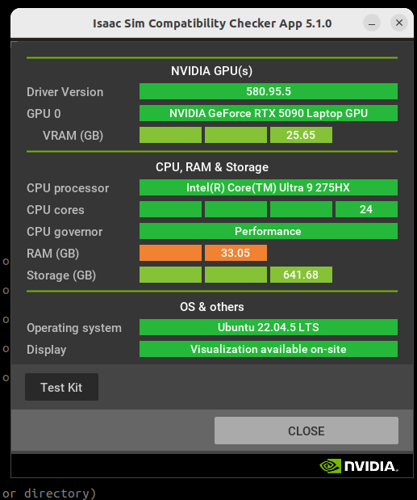
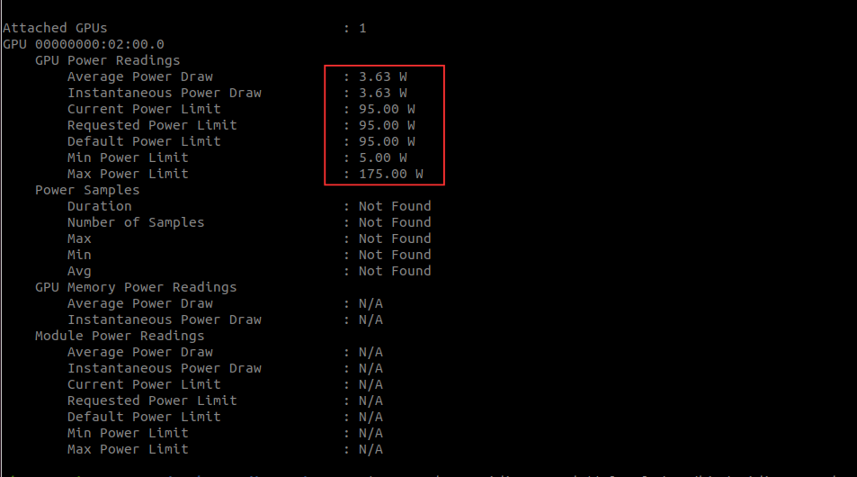
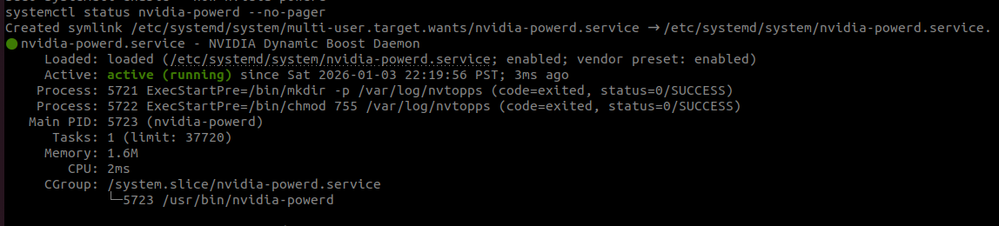
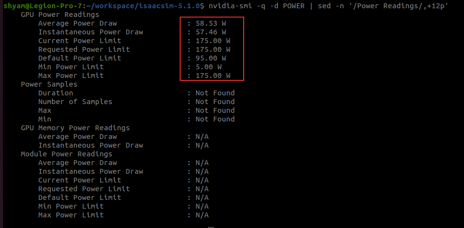

# Troubleshooting Guide - Power Management Issues

This guide helps you diagnose and fix CPU and GPU power management problems that can severely impact Isaac Sim performance.

## Table of Contents

1. [CPU Power Issues](#cpu-power-issues)
2. [GPU Power Issues](#gpu-power-issues)
3. [Getting Help](#getting-help)
4. [Additional Resources](#additional-resources)

---

## CPU Power Issues

### Problem: CPU Running in Power-Saving Mode

#### Detect the Issue

Run the Isaac Sim compatibility check script provided by NVIDIA:

```bash
cd ~/workspace/isaacsim-5.1.0/
./isaac-sim.compatibility_check.sh
```

If you see a warning that your computer is in power-saver mode, and changing the Linux power performance settings doesn't help, you need to update your system configuration.



#### Symptoms
- Slow simulation performance
- Low CPU frequencies (check with `cpupower frequency-info`)
- CPU governor set to `powersave` instead of `performance`
- Turbo boost disabled on AC power

#### Why This Happens
- Linux defaults to power-saving mode to extend battery life
- Some laptop manufacturers ship with conservative power profiles
- Power management daemons (like `power-profiles-daemon`) override performance settings
- BIOS/UEFI settings may limit CPU performance

---

### Solution: Configure TLP for Performance Mode

#### Installation and Configuration

```bash
# 1. Install TLP
sudo apt update
sudo apt install -y tlp tlp-rdw

# 2. Remove conflicting services
sudo apt remove -y laptop-mode-tools power-profiles-daemon
sudo systemctl mask power-profiles-daemon

# 3. Configure TLP
sudo nano /etc/tlp.conf
```

Find and set these lines in `/etc/tlp.conf`:

```bash
# CPU Performance Settings
CPU_SCALING_GOVERNOR_ON_AC=performance
CPU_SCALING_GOVERNOR_ON_BAT=powersave

# CPU Energy Policy
CPU_ENERGY_PERF_POLICY_ON_AC=performance
CPU_ENERGY_PERF_POLICY_ON_BAT=power

# CPU Turbo Boost
CPU_BOOST_ON_AC=1
CPU_BOOST_ON_BAT=0

# Intel HWP Dynamic Boost
CPU_HWP_DYN_BOOST_ON_AC=1
CPU_HWP_DYN_BOOST_ON_BAT=0

# Platform Profile
PLATFORM_PROFILE_ON_AC=performance
PLATFORM_PROFILE_ON_BAT=low-power
```

```bash
# 4. Enable and start TLP
sudo systemctl enable tlp
sudo systemctl start tlp

# 5. Apply settings immediately
sudo tlp start
```

#### Verify TLP Configuration

```bash
# Check TLP status
sudo tlp-stat -s

# Check CPU governor
cat /sys/devices/system/cpu/cpu*/cpufreq/scaling_governor | sort -u
# Expected output: performance (on AC power)

# Check turbo boost status (Intel)
cat /sys/devices/system/cpu/intel_pstate/no_turbo
# Expected output: 0 (turbo enabled)

# Check turbo boost status (AMD)
cat /sys/devices/system/cpu/cpufreq/boost
# Expected output: 1 (boost enabled)

# Check current CPU frequencies
watch -n 1 "grep MHz /proc/cpuinfo | head -n 4"
```

#### Verification

Once the power configuration is done properly, you should see **Performance Mode** in the Isaac Sim compatibility checker.



---

## GPU Power Issues

### Problem: NVIDIA GPU Power Limited

#### Detect the Issue

Run this command to review the current power limit and max power limit for your GPU:

```bash
nvidia-smi -q -d POWER
```

If you see the current GPU power limit is restricted and not at maximum, it can be fixed by following the steps below.



#### Symptoms
- GPU power capped at ~95W instead of full capacity (e.g., 175W)
- Poor Isaac Sim performance during rendering
- `nvidia-smi` shows low power limit: `Pwr:Usage/Cap` = `80W / 95W`
- Thermal throttling is not the cause (temperatures are normal)

#### Why This Happens
- NVIDIA Dynamic Boost daemon (`nvidia-powerd`) is missing or misconfigured
- Systemd service file was removed or corrupted
- D-Bus policy missing, preventing daemon from communicating
- Log directory missing, causing daemon crash on startup
- Common after NVIDIA driver updates or system upgrades

#### Impact
- **50% performance loss** on GPU-intensive tasks
- Slow Isaac Sim scene rendering
- Low FPS in simulations
- Underutilized GPU (shows low utilization despite heavy workload)

---

### Solution: Restore nvidia-powerd Daemon

Follow these steps carefully:

#### Step 1: Verify nvidia-powerd Binary Exists

```bash
# Check if binary exists
command -v nvidia-powerd || ls -l /usr/bin/nvidia-powerd
```

**Expected Output:**
```
/usr/bin/nvidia-powerd
```

**If Missing:**
```bash
# Reinstall NVIDIA drivers (this includes nvidia-powerd)
sudo ubuntu-drivers autoinstall
```

---

#### Step 2: Create Log Directory

**Why:** `nvidia-powerd` crashes without this directory

```bash
# Remove old directory if it exists
sudo rm -rf /var/log/nvtopps

# Create new directory with correct permissions
sudo mkdir -p /var/log/nvtopps
sudo chown root:root /var/log/nvtopps
sudo chmod 755 /var/log/nvtopps

# Verify
ls -ld /var/log/nvtopps
```

**Expected Output:**
```
drwxr-xr-x 2 root root 4096 Jan  3 12:00 /var/log/nvtopps
```

---

#### Step 3: Create D-Bus Policy

**Why:** Allows `nvidia-powerd` to communicate via D-Bus

```bash
# Ensure directory exists
sudo mkdir -p /etc/dbus-1/system.d

# Create D-Bus policy file
sudo tee /etc/dbus-1/system.d/nvidia-powerd.conf >/dev/null <<'EOF'
<!DOCTYPE busconfig PUBLIC
 "-//freedesktop//DTD D-BUS Bus Configuration 1.0//EN"
 "http://www.freedesktop.org/standards/dbus/1.0/busconfig.dtd">
<busconfig>
  <policy user="root">
    <allow own="nvidia.powerd.server"/>
  </policy>
  <policy context="default">
    <allow send_destination="nvidia.powerd.server"/>
    <allow receive_sender="nvidia.powerd.server"/>
  </policy>
</busconfig>
EOF

# Verify file was created
cat /etc/dbus-1/system.d/nvidia-powerd.conf

# Reload D-Bus
sudo systemctl reload dbus
```

---

#### Step 4: Create Systemd Service

**Why:** Manages the daemon as a system service

```bash
# Create systemd service file
sudo tee /etc/systemd/system/nvidia-powerd.service >/dev/null <<'EOF'
[Unit]
Description=NVIDIA Dynamic Boost Daemon
After=dbus.service
Wants=dbus.service

[Service]
Type=simple
ExecStartPre=/bin/mkdir -p /var/log/nvtopps
ExecStartPre=/bin/chmod 755 /var/log/nvtopps
ExecStart=/usr/bin/nvidia-powerd
Restart=on-failure
RestartSec=5

[Install]
WantedBy=multi-user.target
EOF

# Verify file was created
cat /etc/systemd/system/nvidia-powerd.service
```

---

#### Step 5: Enable and Start Service

```bash
# Reload systemd to recognize new service
sudo systemctl daemon-reload

# Enable service to start on boot
sudo systemctl enable nvidia-powerd

# Start service now
sudo systemctl start nvidia-powerd

# Check service status
systemctl status nvidia-powerd --no-pager
```

**Expected Output:**
```
● nvidia-powerd.service - NVIDIA Dynamic Boost Daemon
     Loaded: loaded (/etc/systemd/system/nvidia-powerd.service; enabled)
     Active: active (running) since ...
```



**If Service Fails:**
```bash
# View detailed logs
sudo journalctl -u nvidia-powerd -n 120 --no-pager

# Common issues:
# - Binary not found: Reinstall NVIDIA drivers
# - Permission denied: Check log directory permissions
# - D-Bus error: Verify D-Bus policy file
```

---

#### Step 6: Verify GPU Power Limit

**Initial Check (Idle):**
```bash
nvidia-smi
```


Look at the `Pwr:Usage/Cap` column.

```bash
nvidia-smi -q -d POWER 
```



**✅ Good:** `175W` (or your GPU's rated power)
**❌ Bad:** `95W` (power limited)

**Load Test:**
```bash
# In one terminal, monitor GPU
watch -n 0.5 nvidia-smi

# In another terminal, run a GPU workload:

# Option 1: Isaac Sim
cd ~/workspace/isaac-sim && ./isaac-sim.sh

# Option 2: GPU Benchmark
sudo apt install -y glmark2
glmark2

# Option 3: Stress test
nvidia-smi -i 0 -pl 175  # Manually set power limit
```

**During Load, Verify:**
- Power limit shows full capacity (e.g., `120W / 175W`)
- GPU utilization increases
- Temperature rises appropriately

---

## Additional Resources

- **TLP Documentation:** https://linrunner.de/tlp/
- **NVIDIA Power Management:** https://docs.nvidia.com/deploy/nvml-api/
- **Linux CPU Frequency Scaling:** https://www.kernel.org/doc/html/latest/admin-guide/pm/cpufreq.html
- **Isaac Sim Performance Guide:** https://docs.isaacsim.omniverse.nvidia.com/5.1.0/

---
