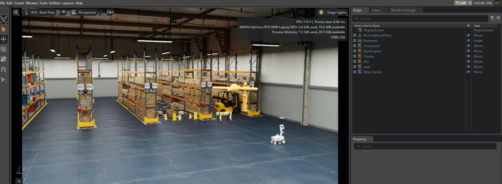

# Isaac Sim on RTX 5090 (Laptop) — Ubuntu setup for **max performance** + real-world FPS/RTF numbers

If you're running **NVIDIA Isaac Sim 5.1** on a **GeForce RTX 5090 Laptop GPU (24GB VRAM)** and experiencing **low FPS, poor performance, or random renderer crashes**, this guide walks through the exact setup + verification workflow to achieve **stable, high FPS** and maximum performance.

This is written as a *practical checklist*: install basics → verify the GPU path is correct → apply performance knobs → benchmark → troubleshoot.

## Table of Contents
1. [TL;DR (what worked)](#tldr-what-worked)
2. [Test Machine Specs](#the-test-machine-reference)
3. [Install Essentials](#1-install-the-essentials-so-you-can-verify-the-graphics-path)
4. [NVIDIA Driver Setup](#2-install-nvidia-driver-and-confirm-its-the-one-actually-in-use)
5. [Force NVIDIA GPU (PRIME)](#3-force-the-system-to-use-the-nvidia-gpu-prime--this-was-critical)
6. [Use Xorg](#4-use-xorg-not-wayland)
7. [Isaac Sim Install](#5-isaac-sim-install-quick-notes)
8. [Common Crashes & Fixes](#6-the-crashes-we-hit-and-why-the-fix-above-mattered)
9. [Performance Optimization](#7-max-performance-knobs-that-actually-matter)
10. [Benchmark Results](#8-benchmarks-what-fpsrtf-to-expect-with-this-exact-setup)
11. [Measuring RTF](#9-how-to-measure-real-time-factor-rtf-correctly)
12. [Troubleshooting](#10-troubleshooting-checklist-fast)
13. [Expected Performance Summary](#11-expected-performance-summary)
14. [Validation Commands](#appendix-the-exact-validation-commands-i-ran)
15. [Contributing & Improvements](#contributing--improvements)

---

## TL;DR (what worked)

- **OS:** Ubuntu **22.04.5 LTS**  
- **Kernel:** **6.8.0-90-generic**  
- **GPU driver:** NVIDIA **580.95.05** (CUDA reports **13.0**)  
- **Isaac Sim:** **5.1.0** (“Isaac Sim Full”)  
- **Display stack:** **Xorg** (not Wayland)  
- **PRIME mode:** `prime-select nvidia` (force dGPU for desktop + Isaac)

**Observed performance (interactive):**
- Empty / light stage: **~115–120 FPS**
- Warehouse stage + robots loaded: **~60 FPS**
- Heavier warehouse with more robots: stayed stable for long runs (no 1–2 minute crash)

### Screenshots from the test run




> These screenshots were captured with the on-screen performance HUD enabled (showing FPS + GPU/CPU memory) and **RTX – Real-Time** rendering.

**Rule-of-thumb for Real Time Factor (RTF):**
- If your sim is configured for **60 Hz physics** and you’re holding **~60 FPS**, you’re typically near **RTF ≈ 1.0**.
- If you dip to ~45 FPS during heavy moments, expect **RTF ≈ 0.75** for a 60 Hz target (unless your sim is decoupled from rendering).

(How to *measure* RTF properly is included below.)

---

## The test machine (reference)

This matters because laptop GPUs + hybrid graphics can behave differently than desktop cards.

- **GPU:** NVIDIA GeForce **RTX 5090 Laptop GPU** (24GB VRAM)
- **CPU:** Intel **Core Ultra 9 275HX**
- **RAM:** ~32 GB
- **Monitors:** internal 2560×1600 @ 240 Hz + external 1920×1080 @ 60 Hz

---

## 1) Install the essentials (so you can verify the graphics path)

### Packages (Ubuntu)
Install these so you can run the exact validation commands:

```bash
sudo apt update
sudo apt install -y mesa-utils vulkan-tools
```

- `mesa-utils` gives you `glxinfo`
- `vulkan-tools` gives you `vulkaninfo` (useful if Vulkan ICD is broken)

---

## 2) Install NVIDIA driver (and confirm it’s the one actually in use)

### Confirm driver version
After installing your NVIDIA driver, verify:

```bash
nvidia-smi
```

Expected (example from this setup):

- Driver Version: **580.95.05**
- CUDA Version: **13.0**
- GPU: **RTX 5090 Laptop GPU**

If `nvidia-smi` fails, Isaac Sim will not be stable.

> Tip: if Secure Boot is enabled, your NVIDIA kernel module can fail to load unless it’s signed. If `nvidia-smi` fails after a reboot, Secure Boot is one of the first things to check.

---

## 3) Force the system to use the NVIDIA GPU (PRIME) — this was critical

Laptop hybrid graphics is the #1 source of “it runs…but crashes” issues. The goal is:

- The *desktop session* renders on NVIDIA
- Isaac Sim uses NVIDIA for OpenGL/Vulkan
- `glxinfo` reports NVIDIA as the OpenGL vendor

### Check PRIME mode
```bash
sudo prime-select query
```

### Force NVIDIA mode
```bash
sudo prime-select nvidia
sudo reboot
```

### Verify OpenGL is truly NVIDIA
```bash
glxinfo -B | sed -n '1,50p'
```

You want to see:

- `direct rendering: Yes`
- `OpenGL vendor string: NVIDIA Corporation`
- `OpenGL renderer string: NVIDIA GeForce RTX 5090 Laptop GPU ...`
- A modern `OpenGL core profile version` (4.6 in this case)

### Verify Isaac + desktop are on the GPU
```bash
nvidia-smi
```

It’s normal to see processes like `Xorg` / `gnome-shell` listed using some VRAM. That’s good: it means the desktop is on NVIDIA.

---

## 4) Use Xorg (not Wayland)

For Isaac Sim on Linux, **Xorg tends to be more stable** than Wayland on many setups.

### How to check
```bash
echo $XDG_SESSION_TYPE
```

- If it prints `x11` → you’re on Xorg ✅
- If it prints `wayland` → consider switching to “Ubuntu on Xorg” at the login screen

---

## 5) Isaac Sim install (quick notes)

Most people install Isaac Sim via Omniverse Launcher or a downloaded package. In this setup, Isaac Sim lived at:

- `~/workspace/isaacsim-5.1.0`

A direct kit launch looks like:

```bash
./kit/kit ./apps/isaacsim.exp.full.kit
```

Or use the provided launch script if you have it (varies by install).

---

## 6) The crashes we hit (and why the fix above mattered)

### Symptoms
- Scene loads fine
- FPS can be decent initially
- When pressing **Play** or moving robots, it **segfaults within 1–2 minutes**

### The log pattern
- Isaac Sim crash reporter triggers
- Stack trace includes **`libnvidia-glcore.so.580.95.05`**
- Example: `Segmentation fault (core dumped)`

This strongly suggests the crash is happening inside the NVIDIA GL stack — often triggered by:
- hybrid graphics misrouting (iGPU/dGPU confusion),
- display server edge cases,
- shader/cache instability in certain configs.

**What fixed it in practice:**  
Ensuring the system was truly running on the NVIDIA GPU (`prime-select nvidia` + OpenGL vendor verification) and keeping the session on Xorg.

### Benign warnings you can ignore
You may see warnings like:

- `Damping attribute is unsupported for articulation joints and will be ignored`

These warnings showed up for the Ant articulation joints and are not usually crash-causing.

---

## 7) “Max performance” knobs that actually matter

### A) Keep an eye on GPU clocks/power while running Isaac
A simple live monitor:

```bash
watch -n 1 'nvidia-smi --query-gpu=pstate,clocks.gr,clocks.mem,pci.link.gen.current,pci.link.width.current,power.draw,utilization.gpu,memory.used --format=csv'
```

In my stable run (warehouse + multiple robots), I saw roughly:

- **Power:** ~70–97 W  
- **P-state:** mostly P2 / P4  
- **Graphics clock:** ~1500–2000 MHz  
- **Memory clock:** ~9001–14001 MHz  
- **VRAM usage:** ~4.2 GB in the tested stage  
- **GPU util:** ~30–46%

> Note: laptop firmware can cap power/clocks depending on AC power, thermal headroom, and vendor performance profiles.

### B) Prefer “RTX Real-Time” for interactive work
For *interactive* simulation + debugging, RTX Real-Time typically gives you much higher FPS than heavy path tracing.

### C) Watch viewport resolution
Even on a strong GPU, viewport resolution can matter a lot. In my testing, a 1280×720 viewport was very smooth. Higher resolutions can reduce FPS quickly.

### D) Don’t benchmark with “everything on”
Turn off heavy sensors / high-frequency RTX sensors while testing stability:
- high-res cameras
- RTX LiDAR at high FPS
- expensive post-processing

Add them back once the base sim is stable.

---

## 8) Benchmarks: what FPS/RTF to expect (with this exact setup)

### Scene A: “Warehouse / stage” (light to moderate)
**Observed:**
- ~115–120 FPS when idle / not playing
- ~60 FPS while sim is playing

### Scene B: Larger warehouse + more robots
**Observed:**
- Stable long runs (no immediate crash)
- FPS depends on robot count + sensors, but remained comfortably interactive

---

## 9) How to measure Real Time Factor (RTF) correctly

RTF is *not* the same as FPS. FPS is rendering speed; RTF is **simulated time / real time**.

### A simple approximation (when physics is tied to the frame loop)
If your physics target is 60 Hz (dt = 1/60 = 0.01667s) and your average frame time is:

- 16.7 ms → RTF ≈ 1.0  
- 22.2 ms (≈45 FPS) → RTF ≈ 0.75  
- 33.3 ms (≈30 FPS) → RTF ≈ 0.5  

### The accurate way
Use Isaac Sim's built-in performance metrics / statistics overlay (or a scripted logger) to read:
- simulation dt
- physics step time
- render time
- sim time vs wall time

For automated RTF logging, consider adding a custom Python extension to Isaac Sim that logs these metrics to a CSV file during benchmark runs.

---

## 10) Troubleshooting checklist (fast)

### ❌ OpenGL vendor is NOT NVIDIA
**Fix:**
- `sudo prime-select nvidia`
- reboot
- re-check `glxinfo -B`

### ❌ Isaac runs, but crashes when pressing Play / moving robots
**Fix (try in this order):**
1. Confirm Xorg session (`echo $XDG_SESSION_TYPE`)
2. Confirm NVIDIA OpenGL path (`glxinfo -B`)
3. Confirm desktop is on NVIDIA (`nvidia-smi` shows Xorg/gnome-shell)
4. Test a clean run (no heavy sensors)
5. Optional: reset Isaac user config (starts fresh)
   ```bash
   ./kit/kit ./apps/isaacsim.exp.full.kit --reset-user
   ```

### ⚠️ Crash reporter GUI shows "exited with code 127"
**Note:** This usually means the crash reporter GUI can't launch due to missing runtime deps. It does **not** cause the crash; it just prevents the nice GUI dialog from appearing.

---

## 11) Expected Performance Summary

Based on the configuration described in this guide:

> "On Ubuntu 22.04.5 (kernel 6.8) with NVIDIA driver 580.95.05 and Isaac Sim 5.1.0, the RTX 5090 Laptop GPU delivers ~115–120 FPS in a light warehouse stage and ~60 FPS while the sim is playing with robots loaded. With a 60 Hz physics target, this achieves near real-time performance (RTF ≈ 1.0) for moderate scenes. Heavier scenes may dip below RTF 1.0 depending on robot count and sensor complexity."

---

## Appendix: The exact validation commands I ran

```bash
sudo prime-select query
glxinfo -B | sed -n '1,50p'
nvidia-smi
watch -n 1 'nvidia-smi --query-gpu=pstate,clocks.gr,clocks.mem,pci.link.gen.current,pci.link.width.current,power.draw,utilization.gpu,memory.used --format=csv'
```

---

## Contributing & Improvements

This guide is open to contributions! Potential enhancements:

- **Automated benchmark script** - A Python script that logs FPS, physics step time, RTF, and scene complexity
- **Additional GPU models** - Performance data from RTX 4090, 4080, etc.
- **Different Isaac Sim versions** - Compatibility notes for 4.x vs 5.x

Submit issues or PRs at [github.com/robosmiths/isaac-sim-lab-installer](https://github.com/robosmiths/isaac-sim-lab-installer)
